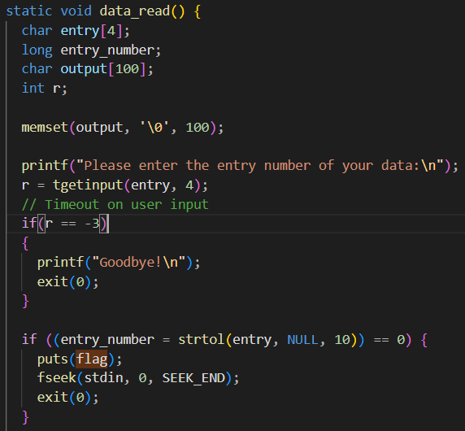
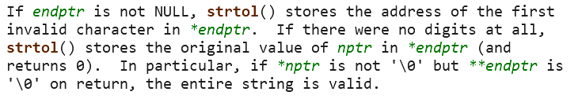
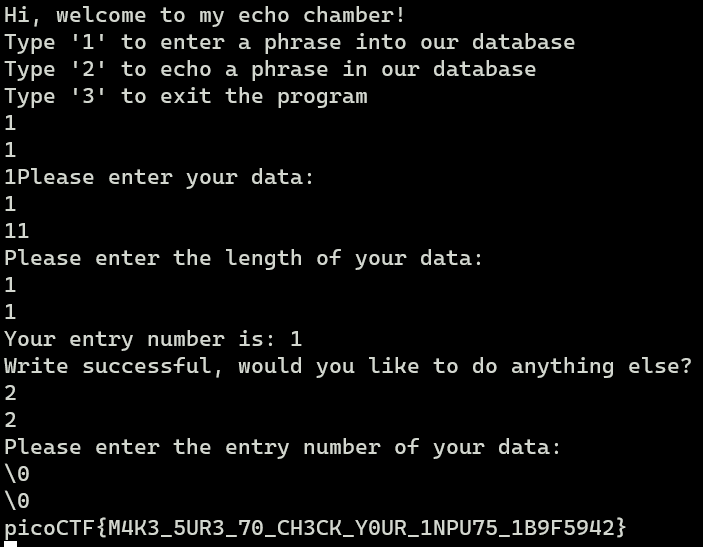

# Basic file exploit
The problem statement:
```
The program provided allows you to write to a file and read what you wrote from it. Try playing around with it and see if you can break it! Connect to the program with netcat: $ nc saturn.picoctf.net 53933 The program's source code with the flag redacted can be downloaded here.
```
Downloading the file we get the source code of what is running.

One part of the code looks interesting:



If strtol returns 0, entry number would be equal to 0 and it would pritn the flag. So I googled to check when does strtol return 0. Turns out it returns 0 if the conversion is not possible 



So I ran the nc command given in the question. Data read is run when I input the entry number of my entry. So I input \0 as the entry number and voila! I get the flag. :D


