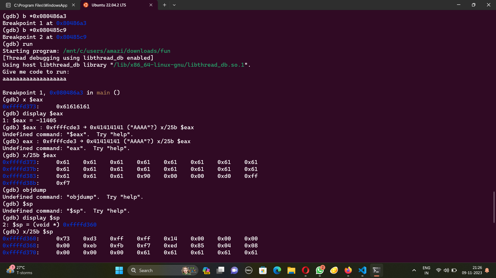

# Buffer overflow 0
The problem statement:
```
Smash the stack Let's start off simple, can you overflow the correct buffer? The program is available here. You can view source here. And connect with it using: nc saturn.picoctf.net 64712
```
I ran the nc command and I knew I needed to causes some sort of overflow. So when it asked me for input, i just input something like 9999999999999999999999999999999999999999999999999999999999999999999999999 and it gave me the flag. :D

