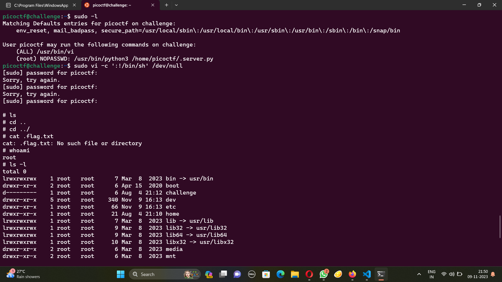
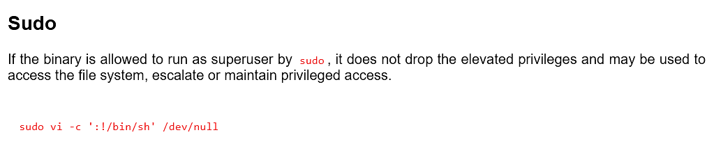
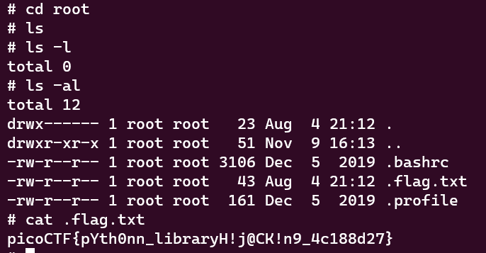

# Hijacking
The problem statement:
```
Getting root access can allow you to read the flag. Luckily there is a python file that you might like to play with. Through Social engineering, we've got the credentials to use on the server. SSH is running on the server.

saturn.picoctf.net 64928
Username: picoctf
Password: urTi-qvQtA
```
So I put in the credentials and sshed into the terminal. I tried the command sudo -l to see what has the root permissions.



(Admittedly that screenshot has a lot more than me just checking what has root permisions.)

Checking what vi does, I find that 



Very interesting. I run it and give the password already given and it gives me root permissions!!!



And we get the flag :D