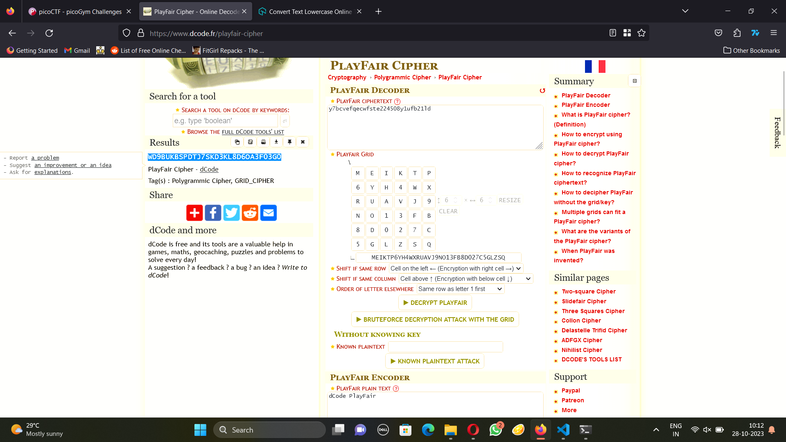

# Play Fair
Problem statement:
```
Not all ancient ciphers were so bad... The flag is not in standard format. nc mercury.picoctf.net 6057 playfair.py
```
I looked up playfair cipher and understood how it works in wikipedia. Then I found a tool to solve such a cipher on dcode.fr. I ran the nc mercury.picoctf.net 6057 and it gave me the alphabet and encrypted message. I input that into dcode.fr and got the decrypted text.



I converted that to lower case and input that as the message and it gave me the flag.

```
$ nc mercury.picoctf.net 6057
Here is the alphabet: meiktp6yh4wxruavj9no13fb8d027c5glzsq
Here is the encrypted message: y7bcvefqecwfste224508y1ufb21ld
What is the plaintext message? wd9bukbspdtj7skd3kl8d6oa3f03g0
Congratulations! Here's the flag: 2e71b99fd3d07af3808f8dff2652ae0e
```