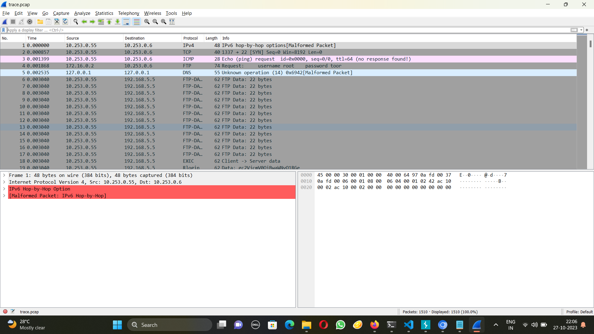
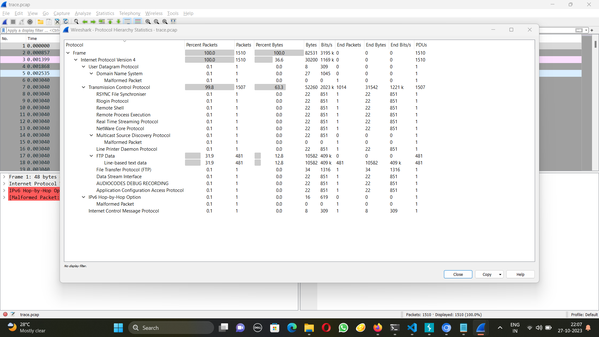
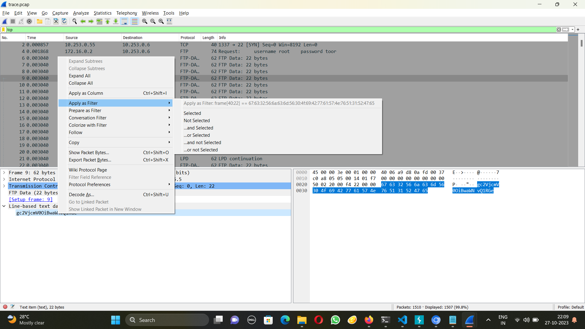
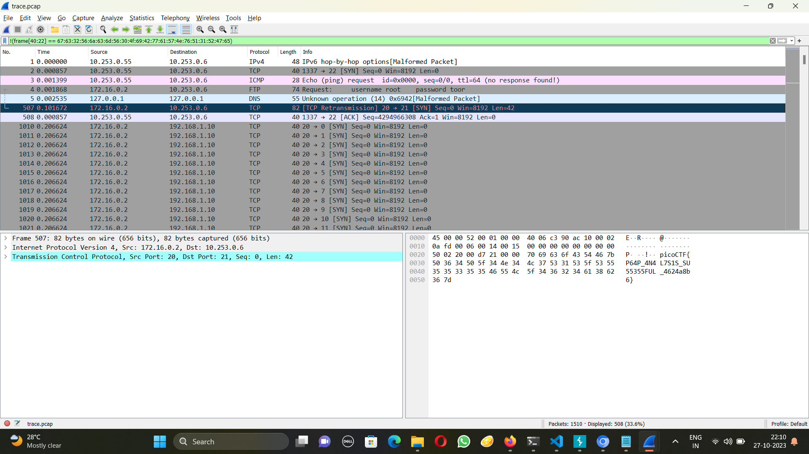

# Pcap Poisoning
The problem statement:
```
How about some hide and seek heh? Download this file and find the flag.
```
I used wireshark and followed the tcp stream.




I saw that 99.8% packets were in tcp stream.



So I filtered by tcp stream. Scrolling through the packets I noticed all of them have the same texts, except a few. One of them told me the flag is nearby. So I filtered by not of that text





That is the flag.