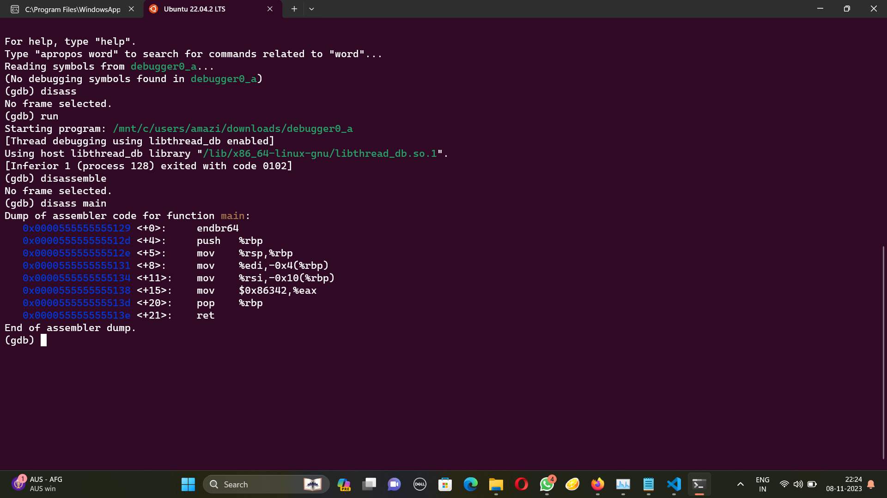

# GDB baby step 1
The problem statement:
```
Can you figure out what is in the eax register at the end of the main function? Put your answer in the picoCTF flag format: picoCTF{n} where n is the contents of the eax register in the decimal number base. If the answer was 0x11 your flag would be picoCTF{17}. Disassemble this.
```
This downloads an elf file. Using gdb I can disassmble main using the 
disass main command.



Here we can see the line "0x0000555555555138 <+15>:    mov    $0x86342,%eax" assigns the value 0x86342 to eax. And tha vlue in decimal is 549698. Hence the flag is picoCTF{549698}. :D