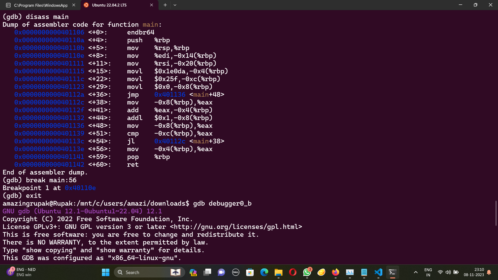
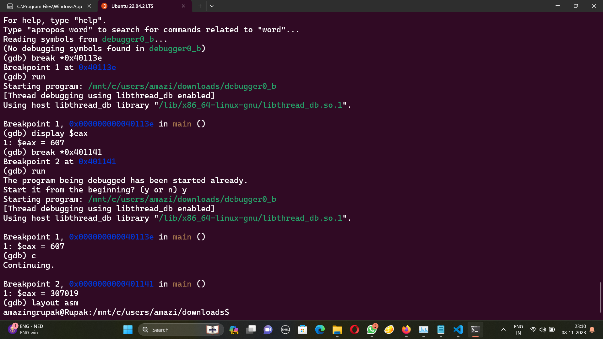

# GDB baby step 2
The problem statement:
```
Can you figure out what is in the eax register at the end of the main function? Put your answer in the picoCTF flag format: picoCTF{n} where n is the contents of the eax register in the decimal number base. If the answer was 0x11 your flag would be picoCTF{17}. Debug this.
```
Disassembling using gdb, we get this 



Putting the break at 0x401141, we can display eax to get the answer 



The flag is picoCTF{307019}