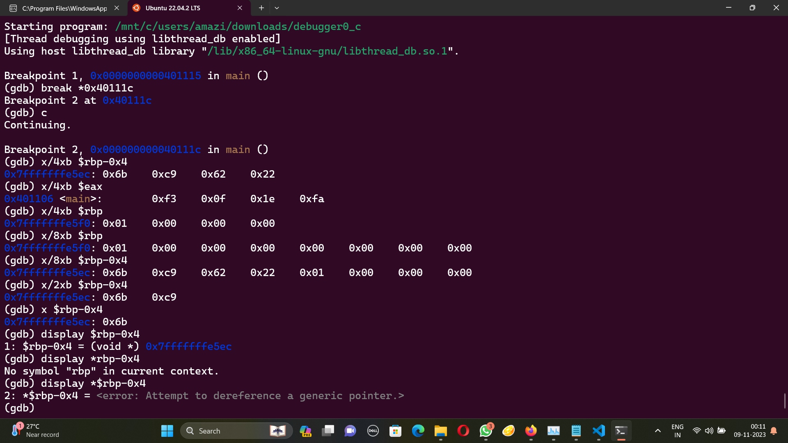

# GDB baby step 3
The problem statement:
```
Now for something a little different. 0x2262c96b is loaded into memory in the main function. Examine byte-wise the memory that the constant is loaded in by using the GDB command x/4xb addr. The flag is the four bytes as they are stored in memory. If you find the bytes 0x11 0x22 0x33 0x44 in the memory location, your flag would be: picoCTF{0x11223344}. Debug this.
```
Using disass main, we get the assembly code. 

```
(gdb) disass main
Dump of assembler code for function main:
   0x0000000000401106 <+0>:     endbr64
   0x000000000040110a <+4>:     push   %rbp
   0x000000000040110b <+5>:     mov    %rsp,%rbp
   0x000000000040110e <+8>:     mov    %edi,-0x14(%rbp)
   0x0000000000401111 <+11>:    mov    %rsi,-0x20(%rbp)
   0x0000000000401115 <+15>:    movl   $0x2262c96b,-0x4(%rbp)
   0x000000000040111c <+22>:    mov    -0x4(%rbp),%eax
   0x000000000040111f <+25>:    pop    %rbp
   0x0000000000401120 <+26>:    ret
End of assembler dump.
```
Putting the address 0x000000000040111c as break point, I can use the command x/4xb to see the contents of the memory location in 4 bytes.



the flag is picoCTF{0x6bc96222}

As a bonus you can see me experimenting to understand how the command works. :P

Alternate solution:

The contents of the memory will be stored with the input taken two at a time but taken in the opposite order so we could just write it in the right order and that is the flag. :D