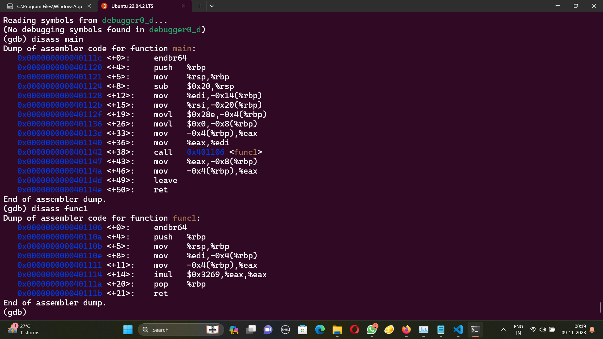

# GDB baby step 4
The problem statement:
```
main calls a function that multiplies eax by a constant. The flag for this challenge is that constant in decimal base. If the constant you find is 0x1000, the flag will be picoCTF{4096}. Debug this.
```
Disassembling, we see that a function is being called. If disassemble that too, we can see the constant being multiplied. That number is 12905 and the flag is picoCTF{12905}

