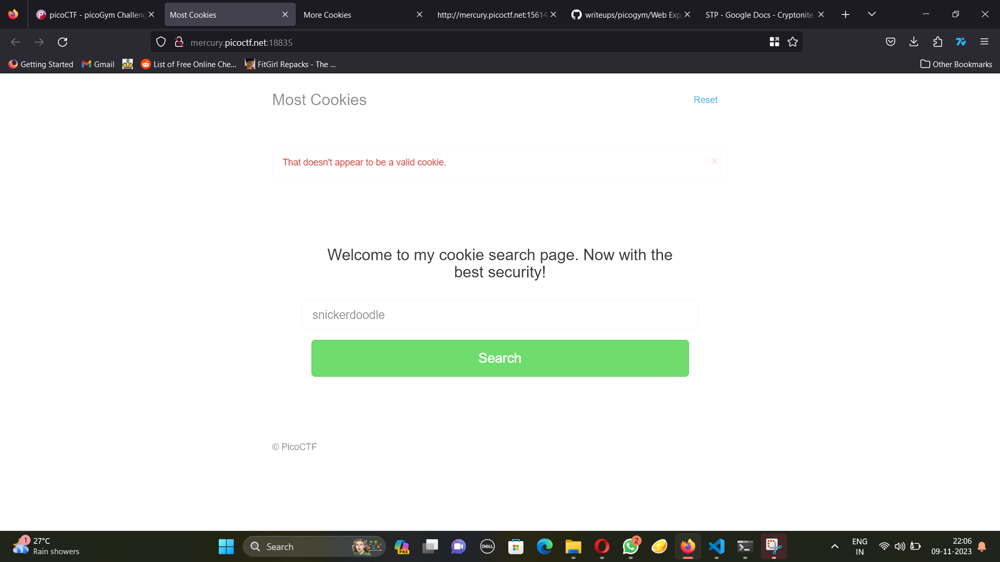
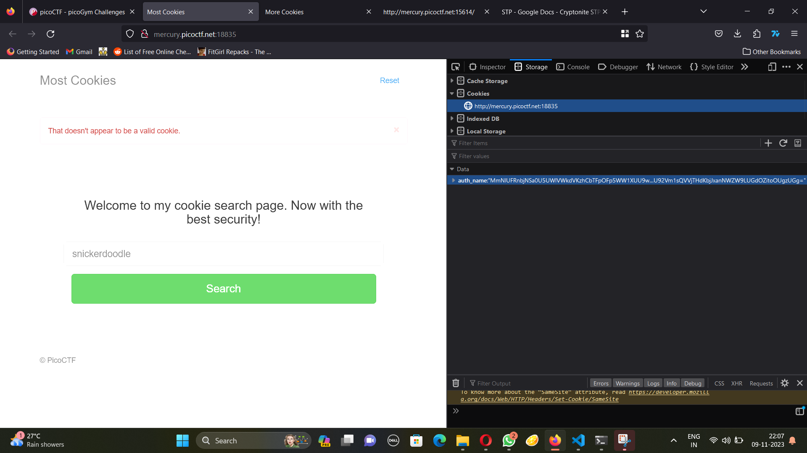

# More cookies




 We can see the auth name in the cookies. After not knowing what to do for way too long, I found that flask session cookies have some sort of hash that is encrypted. 
 In the source code I also found something interesting
```
ookie_names = ["snickerdoodle", "chocolate chip", "oatmeal raisin", "gingersnap", "shortbread", "peanut butter", "whoopie pie", "sugar", "molasses", "kiss", "biscotti", "butter", "spritz", "snowball", "drop", "thumbprint", "pinwheel", "wafer", "macaroon", "fortune", "crinkle", "icebox", "gingerbread", "tassie", "lebkuchen", "macaron", "black and white", "white chocolate macadamia"]
app.secret_key = random.choice(cookie_names)
```
So the secret is a random choice among these cookie names. Hre's the cookie I got from website for the session auth
```
"eyJ2ZXJ5X2F1dGgiOiJzbmlja2VyZG9vZGxlIn0.ZU0LSg.piJLWfRGga19Fpl--DPlZ90xlYw"

```
As they are choosing a random cookie to from a list to I made my own word list of the cookies and bruteforced it.

```
$ flask-unsign --unsign --server 'http://mercury.picoctf.net:65344/' --wordlist wordlist.txt
```


Hurray!!