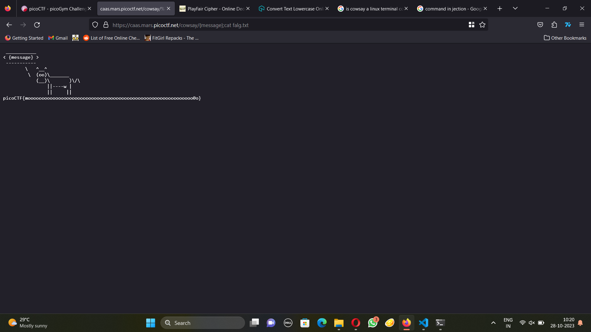

# CAAS

As cowsay is a linux command, my url is probably giving the output from a terminal. I considered doing a command injection. Putting a semicolon in the url and then putting ls, I found that it had a file called falg.txt. I catted it and got the flag.

